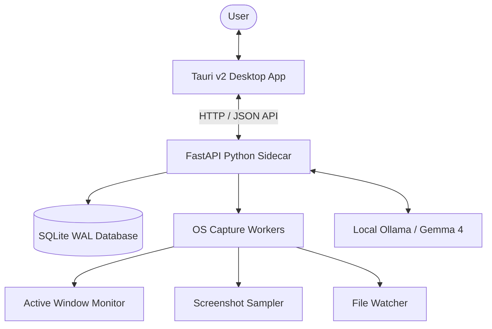

# 🛡️ WorkTrace AI

> Build an evidence-backed timeline of your daily work, generated and cited by local-first AI. **100% Private. Local-First.**

[](https://microsoft.com)
[](https://tauri.app)
[](https://python.org)
[](https://github.com/priyanshuchawda/worktrace-ai)

WorkTrace AI is a local-first activity recorder and timeline engine that helps developers, students, freelancers, and remote workers answer a simple question: **"What did I actually work on, and what evidence supports that?"**

Unlike cloud-heavy tools that surveil your screen, WorkTrace runs entirely on your device, redacts sensitive keys/secrets in real-time, and uses local AI runtimes (like Gemma 4 via Ollama) to draft cited, evidence-backed summaries.

---

## ✨ Key Features

### 📊 Deterministic Event Timeline
Captures active-window titles, metadata-only file watches (no file contents stored), and explicit shell commands into a unified database.

### 📸 Smart Screenshot Sampling
Captures compressed screens with duplicate-skipping heuristics. View OCR snippets and manage your evidence library with fine-grained controls.

### 🔒 On-Device Privacy Center
Automatic redaction patterns block tokens, JWTs, credentials, and custom string regexes before database write. Exclusion rules automatically pause background recording for sensitive apps.

### 🤖 Evidence-Cited AI Summarization
Integrate local model runtimes (such as `gemma-4-E2B` or `gemma-4-E4B`) to synthesize session logs. **Every AI claim is hard-linked to a specific event ID for verifiable accuracy.**

### 📄 Share-Safe Exports
Generate clean Markdown reports showing what you achieved, omitting raw screens and sensitive details so you can share summaries with managers, clients, or team updates.

---

## 🛠️ The Architecture



---

## 🚀 Getting Started

### 📋 Prerequisites
- **Python 3.13** (with `uv` manager)
- **Node.js** & **pnpm**
- **Ollama** (for local AI features)

### 💻 Run Developer Build

Start the app in developer mode with two simple steps.

#### 1. Launch the Python Sidecar
In your first terminal, start the local agent:
```powershell
cd services/local-agent
uv run worktrace-local-agent
```
*Verify sidecar health is active by visiting: `http://127.0.0.1:8765/health`*

#### 2. Start the Tauri Desktop Frontend
In your second terminal, launch the desktop shell:
```powershell
cd apps/desktop
$env:WORKTRACE_SIDECAR_URL="http://127.0.0.1:8765"
pnpm tauri dev
```

---

## ⚙️ Model Setup & AI Integration

WorkTrace supports local-first inference using **Ollama**.

1. Install [Ollama](https://ollama.com).
2. Pull the default target model:
   ```bash
   ollama pull gemma4:e2b
   ```
3. (Optional) For deep analysis mode, pull:
   ```bash
   ollama pull gemma4:e4b
   ```
4. Configure connection settings in the **Desktop Settings Panel**.

*Note: For rapid development, a `gemini_gemma_dev` provider is available to test report templates using a hosted Gemini API key (`GEMINI_API_KEY` in environment).*

---

## 🔍 Validation & Quality Gates

To run the deterministic test suite:

```powershell
# Run validation scopes
pwsh -File scripts/validation/run-local-gates.ps1 -Scope Desktop
pwsh -File scripts/validation/run-local-gates.ps1 -Scope Python
pwsh -File scripts/validation/run-local-gates.ps1 -Scope Shared
```

---

## 🛡️ Core Principles

- **Zero Cloud by Default**: All logs, database writes, and screenshot samples stay strictly local on your machine.
- **No Keylogging**: Terminal command history is manual-post only; keystrokes are never logged globally.
- **Verifiable AI**: Summaries without citations are hallucinations. We enforce strict ID referencing.
- **Complete Deletion**: Deleting a session wipes all associated SQLite records and physical image assets instantly.

---

## 📂 Project Structure

- `apps/desktop` - React frontend with Tauri shell
- `services/local-agent` - FastAPI python agent backend, SQLite persistence, and recorders
- `packages` - Shared typescript/python schemas and validation contracts
- `docs` - Technical designs, security audits, and developer references
- `scripts` - CI/CD, validation gates, and packaging tooling
