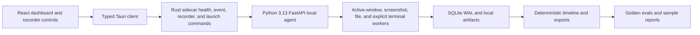

# Architecture

See `../plan.md` for the authoritative roadmap and constraints.

For private-beta product acceptance criteria, first-run user journey, and
startup-readiness blockers, see `docs/private-beta.md`.

The planned architecture is:

```txt
React UI
  -> typed Tauri client
  -> Rust Tauri backend
  -> Python FastAPI sidecar
  -> SQLite WAL + local artifacts
  -> timeline engine
  -> reports/exports
```

The repo now implements the first real recorder signals, but the architecture is
still local-first and evidence-first: native desktop commands talk only to a
localhost sidecar, the sidecar persists raw evidence into SQLite, and AI/runtime
features remain separate from capture workers.

The intended product runtime remains local-first. A hosted Gemini/Gemma provider
is allowed only as an explicitly enabled development accelerator, not as the
default shipped product architecture. Hosted report generation must be labelled,
must use redacted minimal report context, and must not upload screenshots or raw
artifacts by default.

## Current implementation map



Implemented today:

- desktop shell and preview UI
- typed sidecar health, event, recorder-control, and configured launch/stop checks
- Python FastAPI health and session-control foundation
- SQLite WAL migrations and repositories
- fake session validation and export
- real Windows active-window polling
- real Windows screenshot capture, compressed PNG artifacts, retention cleanup, and artifact metadata
- metadata-only configured-folder file watching
- explicit safe terminal command ingestion
- privacy redaction and private-mode suppression across implemented capture workers
- deterministic timeline, Markdown export, and report foundations
- local model availability fallback states
- selective OCR guardrails and OCR/audio/embedding/vision contracts without bundled model loading
- workflow debugger rules, golden evals, and resource budget checks
- short and 30-minute local recorder readiness benchmark profiles
- local Windows package build and installer install/run QA evidence with known release-readiness limits
- release hardening decision record for signing, updater, release channels, and sidecar bundle gates

Not implemented yet:

- JPEG/WebP screenshot encoding
- desktop privacy center and configurable blocklist UI
- production signing or updater
- real model runtime downloads
- bundled OCR/model runtime integrations
- development-only hosted Gemini/Gemma provider wiring
- release-grade model/runtime quality benchmarks
